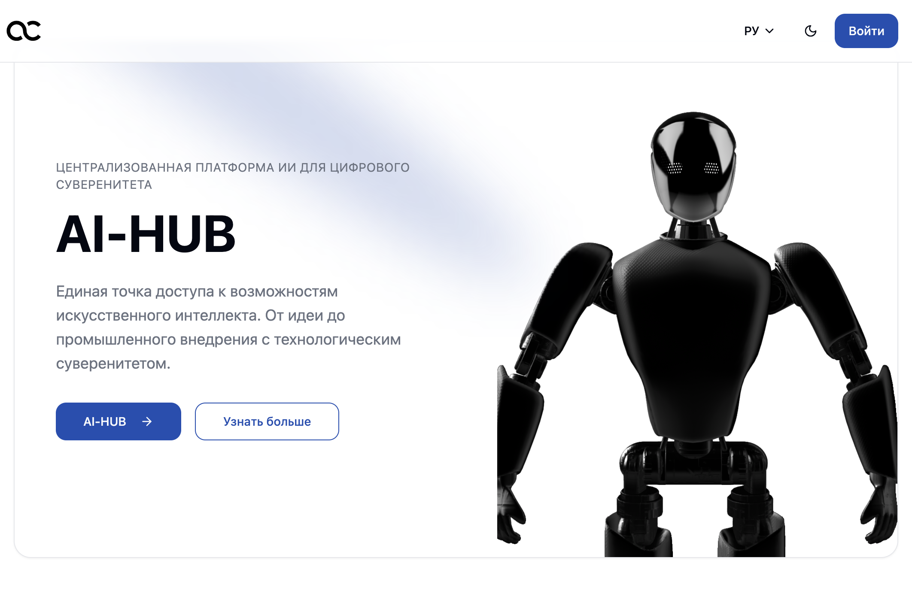
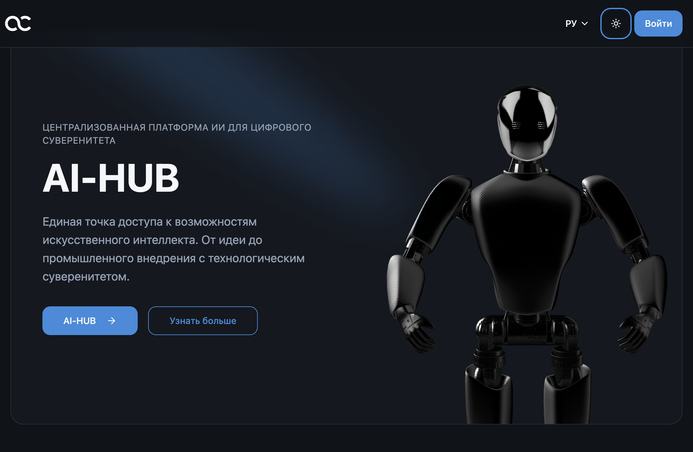
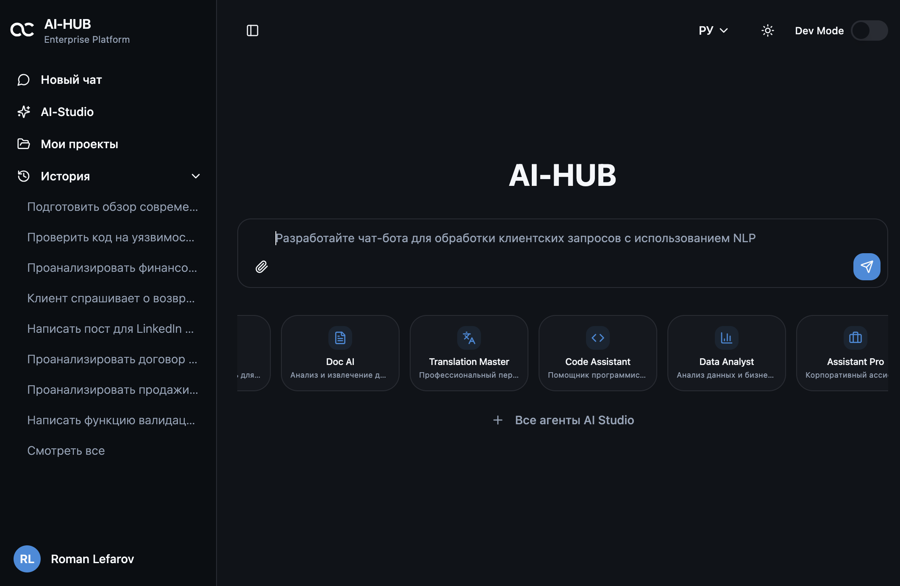
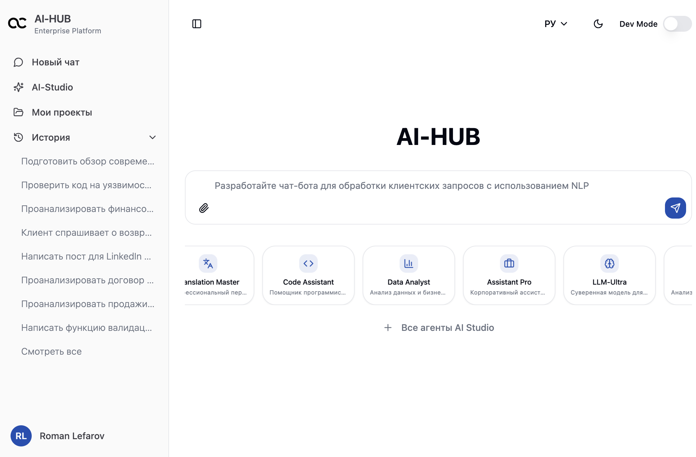
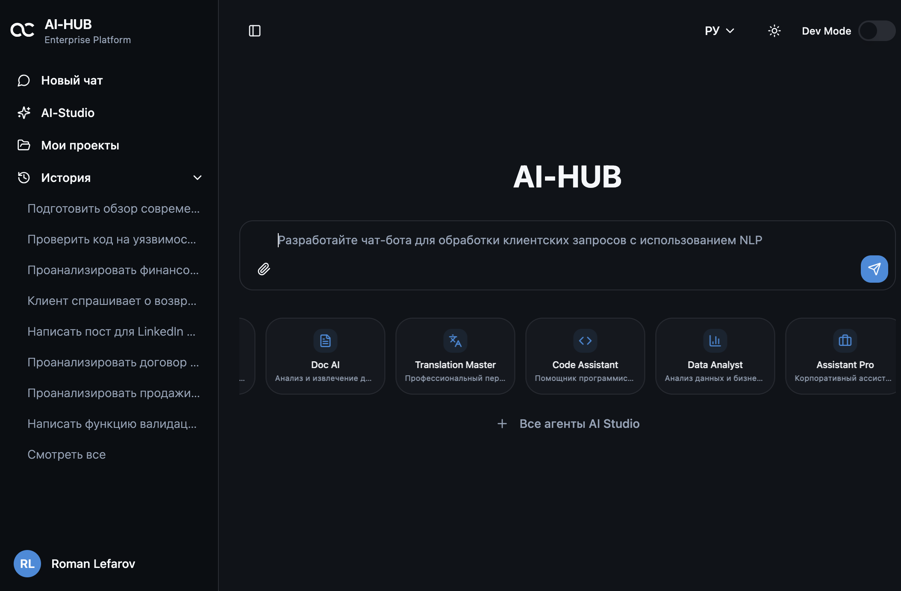
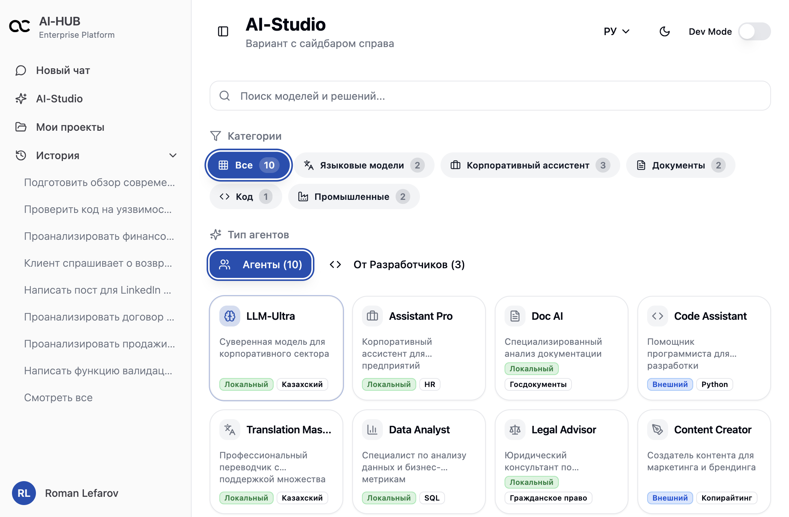
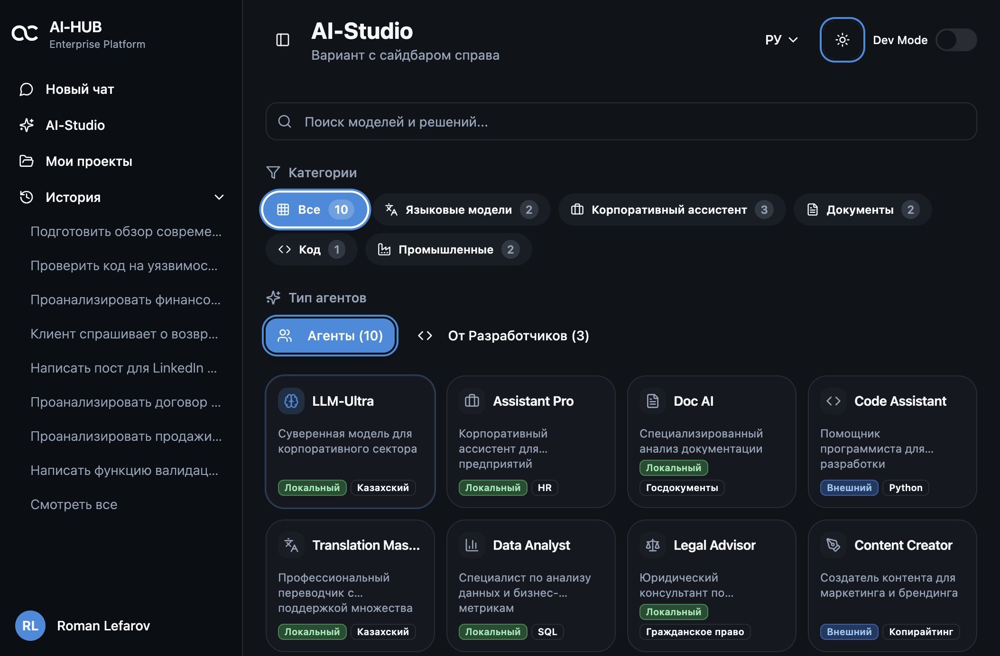
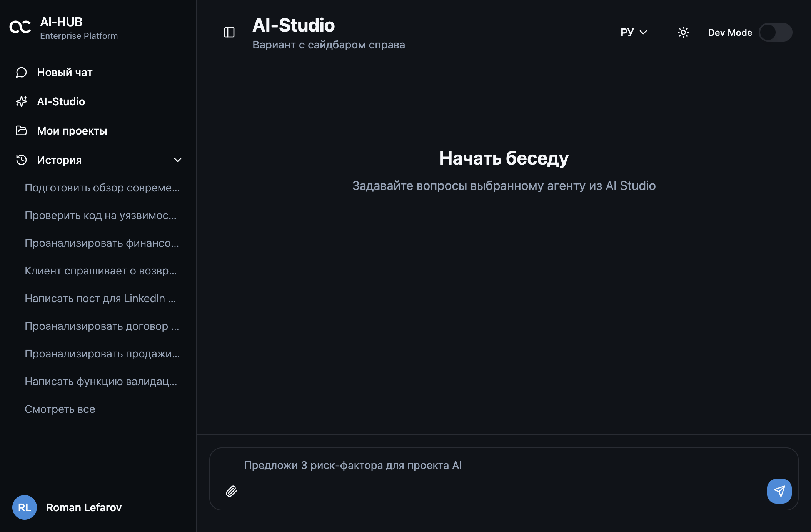
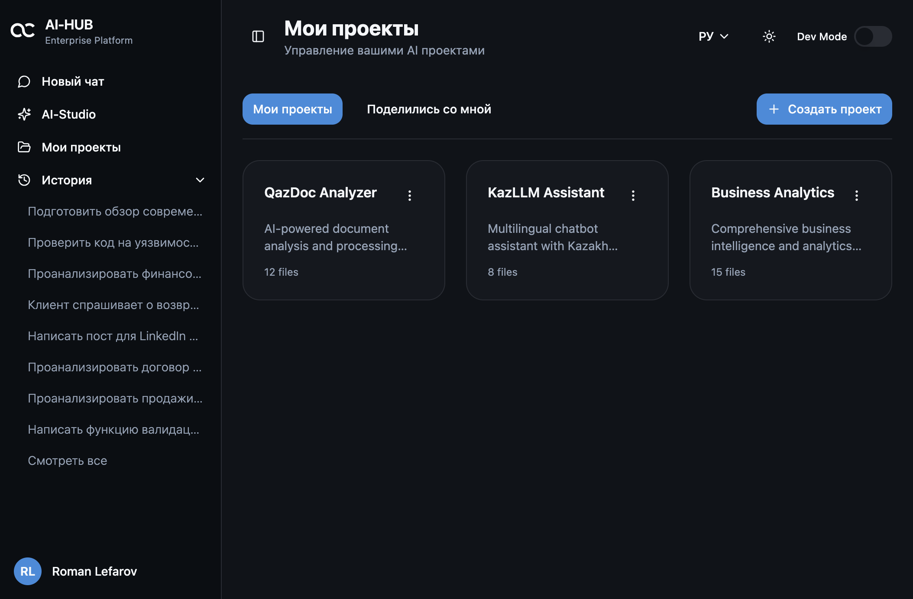
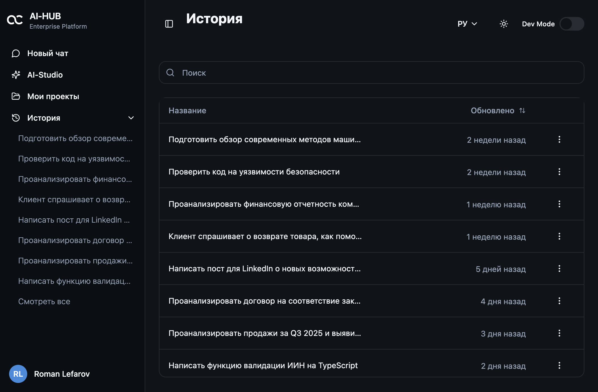

# УТВЕРЖДАЮ

Технический директор

ТОО «QazCloud»

_________________ Перепелов А.В.

«____» ______________ 2025 г.

---

# AI-HUB

**ТОО «QazCloud»**

**«Утвержденный прототип AI-HUB 2.0»**

На листах макеты из прототипа

---

г. Астана, 2025

---

# СОДЕРЖАНИЕ

1. [ВВЕДЕНИЕ](#введение)
2. [ОПИСАНИЕ ЭКРАНОВ ПРОТОТИПА](#описание-экранов-прототипа)
   - 2.1. [Главная страница (Landing Page)](#21-главная-страница-landing-page)
   - 2.2. [Панель управления (Dashboard)](#22-панель-управления-dashboard)
   - 2.3. [AI Studio](#23-ai-studio)
   - 2.4. [Интерфейс чата](#24-интерфейс-чата)
   - 2.5. [Проекты](#25-проекты)
   - 2.6. [История чатов](#26-история-чатов)
3. [ЗАКЛЮЧЕНИЕ](#заключение)

---

# ВВЕДЕНИЕ

Настоящий документ представляет утвержденный прототип платформы AI-HUB 2.0, разработанный ТОО «QazCloud». Прототип демонстрирует ключевые функциональные возможности платформы для централизованной разработки, развертывания и эксплуатации решений на основе технологий искусственного интеллекта и машинного обучения.

**Цель создания прототипа:**

Прототип разработан для визуализации и демонстрации основных экранов и функциональности платформы AI-HUB 2.0, обеспечивая наглядное представление пользовательского интерфейса, навигации и ключевых возможностей системы.

**Обзор функциональности:**

Платформа AI-HUB 2.0 представляет собой комплексное решение для работы с AI-агентами, включающее:

- **Главную страницу** с информацией о платформе и призывом к действию
- **Панель управления** с основным интерфейсом чата и быстрым доступом к популярным агентам
- **AI Studio** — каталог всех доступных AI-агентов с возможностью поиска и фильтрации
- **Интерфейс чата** для взаимодействия с выбранным AI-агентом
- **Управление проектами** для организации работы с AI-решениями
- **Историю чатов** для отслеживания всех взаимодействий

Прототип реализован с поддержкой светлой и темной темы оформления, а также адаптивного дизайна для мобильных устройств.

---

# ОПИСАНИЕ ЭКРАНОВ ПРОТОТИПА

## 2.1. Главная страница (Landing Page)

**Назначение:** Главная страница платформы AI-HUB служит точкой входа для пользователей и предоставляет общую информацию о возможностях платформы.

**Основная функциональность:**

Главная страница состоит из нескольких ключевых секций:

1. **Hero Section (Главная секция)**
   - Заголовок "AI-HUB" с градиентным оформлением
   - Описание платформы и ее основных возможностей
   - Кнопка призыва к действию "Начать работу" для перехода к авторизации
   - Анимированные фоновые градиенты для визуального эффекта
   - Декоративные элементы и эффект Spotlight

2. **Секция преимуществ (Advantages Section)**
   - Демонстрация ключевых преимуществ платформы
   - Визуальные иконки с градиентным оформлением
   - Краткое описание каждого преимущества

3. **Секция сервисов (Services Section)**
   - Описание основных сервисов платформы
   - Список возможностей с визуальными индикаторами
   - Анимированные элементы интерфейса

4. **Секция платформы (Platform Section)**
   - Детальное описание технических возможностей платформы
   - Визуализация ключевых компонентов системы

**Особенности дизайна:**

- Поддержка светлой и темной темы оформления
- Адаптивный дизайн для различных размеров экранов
- Современный минималистичный интерфейс в корпоративном стиле QazCloud
- Плавные анимации и переходы
- Использование градиентов и эффектов свечения

**Скриншоты:**

*Рисунок 1. Главная страница платформы AI-HUB (светлая тема)*

*Рисунок 2. Главная страница платформы AI-HUB (темная тема)*

*Рисунок 3. Главная страница платформы AI-HUB (мобильная версия, темная тема)*

---

## 2.2. Панель управления (Dashboard)

**Назначение:** Панель управления является основным рабочим пространством пользователя, предоставляя доступ к главному чат-интерфейсу и быстрому выбору популярных AI-агентов.

**Основная функциональность:**

1. **Главный чат-интерфейс**
   - Поле ввода для сообщений пользователя
   - Отображение истории диалога с AI-агентом
   - Индикатор загрузки при генерации ответа
   - Отображение времени генерации ответа
   - Система обратной связи (лайки/дизлайки) для оценки качества ответов

2. **Быстрый доступ к популярным агентам**
   - Карточки с популярными AI-агентами под полем ввода
   - Отображение названия, описания и иконки каждого агента
   - Теги "Локальный" и "Внешний" для указания типа агента
   - Быстрый переход к чату с выбранным агентом
   - Анимация бегущей строки (marquee) для популярных агентов

3. **Боковая панель навигации**
   - Доступ к основным разделам платформы
   - История недавних чатов
   - Кнопка создания нового чата
   - Переключение темы оформления
   - Выбор языка интерфейса
   - Выход из системы

4. **Примеры промптов**
   - Автоматически сменяющиеся примеры запросов для быстрого старта
   - Помощь пользователю в формулировке запросов

**Ключевые элементы интерфейса:**

- Заголовок страницы "AI-HUB"
- Область отображения сообщений с прокруткой
- Поле ввода с кнопкой отправки
- Карточки агентов с Apple-style squircle закруглениями
- Боковая панель с навигацией и историей

**Особенности дизайна:**

- Единый стиль оформления с использованием корпоративных цветов
- Поддержка светлой и темной темы
- Адаптивный дизайн для мобильных устройств
- Плавные анимации при взаимодействии
- Компактные карточки агентов с эффектом наведения

**Скриншоты:**

*Рисунок 4. Панель управления (темная тема)*

*Рисунок 5. Панель управления (светлая тема)*

*Рисунок 6. Панель управления (мобильная версия, темная тема)*

---

## 2.3. AI Studio

**Назначение:** AI Studio представляет собой каталог всех доступных AI-агентов платформы, позволяющий пользователям просматривать, искать и выбирать подходящих агентов для своих задач.

**Основная функциональность:**

1. **Каталог агентов**
   - Сетка карточек с информацией о каждом агенте
   - Название, описание и категория каждого агента
   - Иконка, визуально представляющая назначение агента
   - Теги для указания типа агента ("Локальный" / "Внешний")
   - Дополнительные теги с категориями (например, "Казахский", "Русский", "Python", "HR")

2. **Поиск и фильтрация**
   - Поле поиска для быстрого нахождения агентов по названию или описанию
   - Фильтры по категориям (языки, помощники, документы, код, промышленность)
   - Фильтр по типу агента (все / агенты / разработчики)

3. **Карточки агентов**
   - Компактный дизайн с единым размером для всех карточек
   - Ограничение описания до 2 строк с многоточием
   - Отображение до 2 тегов с индикатором "+N" для дополнительных
   - Эффект наведения с увеличением масштаба
   - Apple-style squircle закругления углов (20px радиус)

4. **Навигация**
   - Переход к чату с выбранным агентом по клику на карточку
   - Заголовок страницы "AI Studio" с описанием

**Категории агентов:**

- **Языковые модели** (LLM-Ultra, Translation Master)
- **Корпоративные помощники** (Assistant Pro, Customer Support)
- **Работа с документами** (Doc AI, Legal Advisor)
- **Разработка** (Code Assistant, Security Auditor)
- **Аналитика** (Data Analyst, Financial Advisor)
- **Контент** (Content Creator, Research Assistant)
- **Промышленные решения** (Industrial AI, Factory Optimizer)

**Особенности дизайна:**

- Единообразные карточки агентов одинакового размера
- Минималистичный дизайн с акцентом на информацию
- Поддержка светлой и темной темы
- Плавные переходы и анимации
- Оптимизированная сетка для различных размеров экранов

**Скриншоты:**

*Рисунок 7. AI Studio - каталог агентов (светлая тема)*

*Рисунок 8. AI Studio - каталог агентов (темная тема)*

---

## 2.4. Интерфейс чата

**Назначение:** Интерфейс чата обеспечивает прямое взаимодействие пользователя с выбранным AI-агентом, позволяя вести диалог, загружать файлы и получать интеллектуальные ответы.

**Основная функциональность:**

1. **Область чата**
   - Отображение истории сообщений с прокруткой
   - Разделение сообщений пользователя и агента
   - Индикатор загрузки при генерации ответа
   - Отображение времени генерации ответа в секундах
   - Автоматическая прокрутка к новым сообщениям

2. **Поле ввода и отправка**
   - Многострочное поле ввода для сообщений
   - Кнопка отправки сообщения
   - Кнопка загрузки файлов
   - Плейсхолдер с примером запроса для выбранного агента
   - Поле ввода всегда видимо и не скрывается

3. **Боковая панель истории сессий**
   - Список предыдущих сессий чата с агентом
   - Отображение первого сообщения каждой сессии
   - Время последней активности
   - Быстрый переход к любой сессии
   - Кнопка создания новой сессии
   - Возможность сворачивания/разворачивания панели

4. **Система обратной связи**
   - Кнопки "лайк" и "дизлайк" для каждого ответа агента
   - Визуальная индикация выбранной оценки (закрашенная иконка)
   - Модальное окно обратной связи при нажатии "дизлайк"
   - Выбор причины неудовлетворительного ответа из предустановленного списка
   - Дополнительное текстовое поле для детального отзыва
   - Кнопка отправки обратной связи

5. **Информация об агенте**
   - Отображение названия и описания выбранного агента
   - Иконка агента
   - Индикатор типа агента (Локальный/Внешний)

**Ключевые элементы интерфейса:**

- Заголовок с информацией об агенте
- Боковая панель истории (слева)
- Основная область чата
- Поле ввода внизу экрана
- Кнопки обратной связи для каждого сообщения

**Особенности дизайна:**

- Чистый интерфейс без отвлекающих элементов
- Поддержка темной темы
- Адаптивная верстка
- Плавные анимации при появлении сообщений
- Визуальное разделение сообщений пользователя и агента

**Скриншоты:**

*Рисунок 9. Интерфейс чата с AI-агентом (темная тема)*

---

## 2.5. Проекты

**Назначение:** Раздел "Проекты" позволяет пользователям организовывать и управлять своими AI-проектами, группируя связанные чаты и файлы.

**Основная функциональность:**

1. **Список проектов**
   - Сетка карточек с информацией о каждом проекте
   - Название проекта
   - Описание проекта
   - Количество файлов в проекте
   - Визуальная иконка проекта

2. **Управление проектами**
   - Кнопка создания нового проекта
   - Модальное окно для создания проекта с полями:
     - Название проекта
     - Описание проекта
   - Редактирование названия проекта (inline editing)
   - Удаление проекта через выпадающее меню
   - Поделиться проектом

3. **Навигация**
   - Переход к чату проекта по клику на карточку
   - Вкладки "Мои проекты" и "Общие проекты"
   - Заголовок страницы "Мои проекты"

4. **Дополнительные действия**
   - Выпадающее меню с действиями для каждого проекта:
     - Редактирование
     - Поделиться
     - Удаление

**Ключевые элементы интерфейса:**

- Заголовок страницы с описанием
- Вкладки для фильтрации проектов
- Кнопка создания нового проекта
- Сетка карточек проектов
- Выпадающие меню для действий

**Особенности дизайна:**

- Карточки проектов с единым стилем
- Минималистичный интерфейс
- Поддержка темной темы
- Плавные переходы при взаимодействии
- Адаптивная сетка для различных размеров экранов

**Скриншоты:**

*Рисунок 10. Управление проектами (темная тема)*

---

## 2.6. История чатов

**Назначение:** Раздел "История чатов" предоставляет полный обзор всех взаимодействий пользователя с AI-агентами, позволяя просматривать, фильтровать и сортировать историю чатов.

**Основная функциональность:**

1. **Таблица истории чатов**
   - Список всех чатов в табличном формате
   - Колонки:
     - Текст первого сообщения чата
     - Время создания (относительное время: "2 часа назад", "1 день назад" и т.д.)
     - Тип взаимодействия (чат / VEO промпт)
     - Использованная модель/агент
   - Строки таблицы кликабельны для перехода к чату

2. **Поиск и фильтрация**
   - Поле поиска для быстрого нахождения чатов по тексту
   - Фильтры по типу взаимодействия
   - Фильтры по используемой модели

3. **Сортировка**
   - Сортировка по времени создания
   - По умолчанию: от новых к старым (desc)
   - Переключение направления сортировки
   - Визуальный индикатор направления сортировки

4. **Дополнительные действия**
   - Выпадающее меню для каждого чата:
     - Открыть в новой вкладке
     - Редактировать
     - Удалить

5. **Группировка по времени**
   - Автоматическая группировка чатов по периодам:
     - Сегодня
     - Вчера
     - На этой неделе
     - Ранее

**Ключевые элементы интерфейса:**

- Заголовок страницы "История"
- Поле поиска
- Кнопки фильтров и сортировки
- Таблица с историей чатов
- Выпадающие меню для действий

**Особенности дизайна:**

- Чистая табличная структура
- Поддержка темной темы
- Адаптивная верстка
- Визуальное разделение групп по времени
- Интуитивная навигация

**Скриншоты:**

*Рисунок 11. История чатов (темная тема)*

---

# ЗАКЛЮЧЕНИЕ

Прототип платформы AI-HUB 2.0 успешно демонстрирует ключевые функциональные возможности системы для работы с AI-агентами. Реализованы все основные экраны и компоненты интерфейса, обеспечивающие полноценное взаимодействие пользователя с платформой.

**Резюме реализованного функционала:**

1. **Главная страница** с информационными секциями и призывом к действию
2. **Панель управления** с основным чат-интерфейсом и быстрым доступом к агентам
3. **AI Studio** с каталогом всех доступных AI-агентов и возможностями поиска
4. **Интерфейс чата** для взаимодействия с выбранным агентом
5. **Управление проектами** для организации работы
6. **История чатов** для отслеживания всех взаимодействий

**Ключевые особенности прототипа:**

- **Единый дизайн:** Все экраны выполнены в едином корпоративном стиле QazCloud с минималистичным подходом
- **Адаптивность:** Полная поддержка различных размеров экранов, включая мобильные устройства
- **Темы оформления:** Реализована поддержка светлой и темной темы для комфортной работы в любое время
- **Современный UI/UX:** Использование Apple-style squircle закруглений, плавных анимаций и градиентов
- **Интуитивная навигация:** Понятная структура и логичная организация элементов интерфейса
- **Система обратной связи:** Встроенный механизм оценки качества ответов AI-агентов

**Готовность к дальнейшей разработке:**

Прототип готов к использованию в качестве визуального референса для дальнейшей разработки платформы. Все основные экраны и компоненты интерфейса проработаны и могут служить основой для реализации полнофункциональной системы.

Прототип демонстрирует соответствие требованиям к дизайну:
- Соответствие корпоративному стилю QazCloud
- Простота и удобство навигации
- Минималистичный дизайн
- Адаптивный дизайн для мобильных и планшетных устройств
- Визуальные элементы, простые для восприятия

---

**Конец документа**

